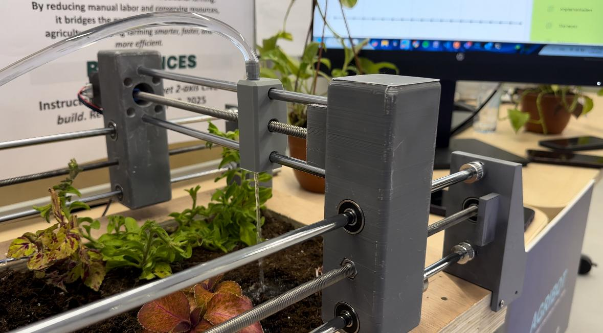
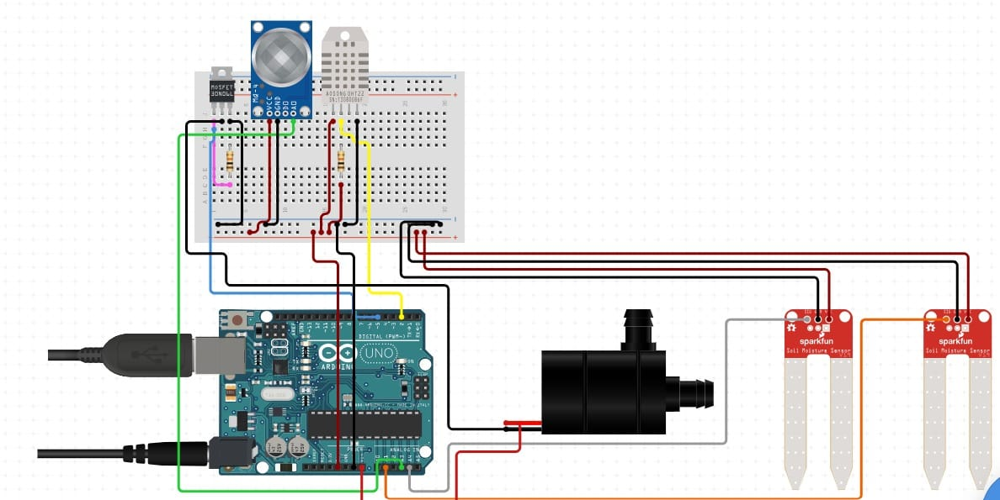

# AgriBot

AgriBot is one of the final projects at MIT International Science & Technology Initiatives (MISTI) in Bahrain for the year 2025.


## Overview

AgriBot is an innovative project aimed at simplifying and automating farming and planting tasks. By repurposing an old 3D printer, we developed a CNC machine that moves along two axes in the soil bed. It detects soil moisture levels and automatically positions itself to water the plants as needed. Additionally, AgriBot features a real-time data dashboard with visual graphs, enabling farmers to monitor plant conditions remotely with ease.

## About this repo

This github repository is a compilation of the code used to make this project come to life, it includes `.ino` files as well as `main.py` file, used to construct a simple dynamic dashboard for the AgriBot machine.

## Circuit

To get the intended result from AgriBot.ino you will need to wire the circuit as follows


Hardware:

- **ArduinoUNO** : The microcontroller used to control all sensors.
- **DHT-11** : Humidity & Temperature sensor.
- **LM393-Soil-Moisture-sensor** : Used to sense the soil's moisture.
- **MQ135** : Air Quality sensor.

## Prerequisites

Before running the Python script, ensure the following prerequisites are met:

1. **Completed Circuit:** Verify that your circuit is fully assembled and correctly wired.

2. **Arduino Setup:**

   - Upload the provided `.ino` file to your Arduino board.
   - **Crucially, close the Arduino IDE** after the upload is complete. This is necessary to free up the serial port for the Python script.

3. **Python Libraries:** Install the required Python libraries. You can typically do this using pip:

   ```bash
   pip install -r requirements.txt
   ```

## Deployment

in VS Code (or your preferred code editor) run the following command in the terminal

```Python
py main.py
```

## Contributing

Pull requests are welcome. For major changes, please open an issue first
to discuss what you would like to change.

Please make sure to update tests as appropriate.
